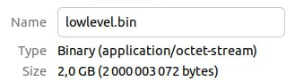
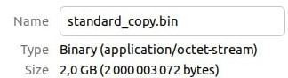

# System Programming

This repository contains a compilation of laboratory assignments from the System Programming course, focusing on the C language within the Linux operating system.

## Лабораторна робота №5

### Завдання

Написати програму, яка створює файл заданого розміру за допомогою:

a. Низькорівневих функцій вводу-виводу;
b. Стандартних функцій для роботи з файлами мови C;
c. Функції `mmap()`.

Також виконати копіювання вихідного файлу в новий файл із заданим ім’ям також трьома способами. Обчислити час створення та копіювання файлу кожним способом. Розміри файлу в залежності від варіанту:

1. Шість гігабайт.
2. Два гігабайта.
3. Три гігабайта.
4. Чотири гігабайта.
5. П’ять гігабайт.

Ваш варіант: 2 (Два гігабайта)

### Створення файлу

#### Створення файлу за допомогою низькорівневих функцій вводу-виводу

```bash

make create_lowlevel

```



#### Створення файлу за допомогою стандартних функцій для роботи з файлами мови С

```bash

make create_standard

```


#### Створення файлу за допомогою функції mmap().

```bash

make create_mmap

```


### Копіювання файлу

#### Копіювання файлу за допомогою низькорівневих функцій вводу-виводу

```bash

make copy_lowlevel

```


#### Копіювання файлу за допомогою стандартних функцій для роботи з файлами мови С

```bash

make copy_standard

```



#### Копіювання файлу за допомогою функції mmap().

```bash

make copy_mmap

```


